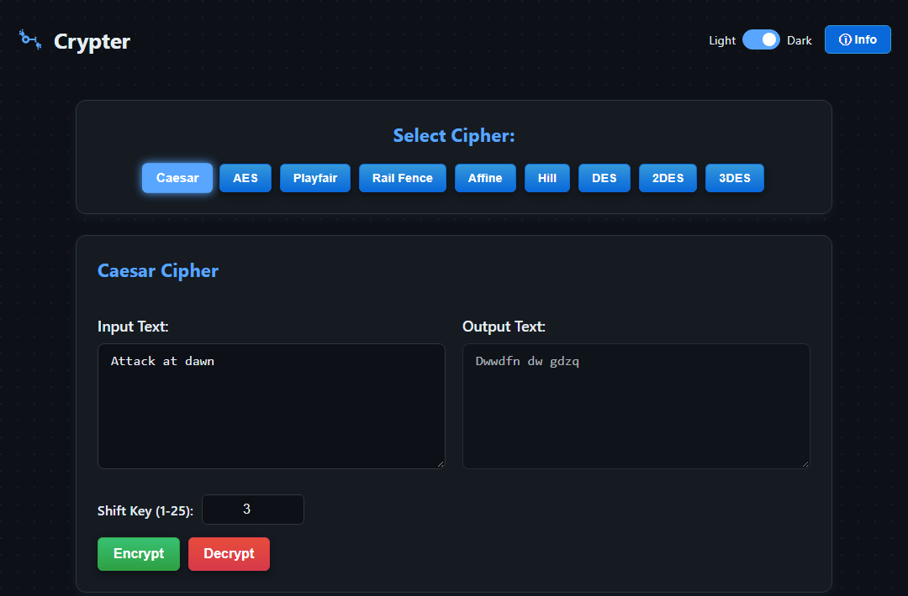

# Crypter

[](https://github.com/JampaniKomal/Crypter/actions/workflows/ci.yml)

A versatile, client-side web application for encrypting and decrypting text with a
range of classical and modern ciphers. Everything runs in your browser — no text
ever leaves the page.

**Live Demo:** [jampanikomal.github.io/Crypter/](https://jampanikomal.github.io/Crypter/)



## Features

- **Nine ciphers:**
    - **Classical:** Caesar, Rail Fence, Playfair, Affine, and Hill.
    - **Modern (symmetric):** DES, 2DES, 3DES, and AES.
- **Everything is local.** All encryption and decryption happens in the browser;
  nothing is sent to a server.
- **One unified tool.** Switch ciphers with a click; the key inputs and controls
  update to match the selected algorithm.
- **Light / dark theme**, remembered across visits.
- **Info modal** with a short description of every cipher.
- **Responsive**, with a collapsible cipher list on small screens.

## How it works

The classical ciphers are implemented from scratch in plain JavaScript. The modern
block ciphers delegate to [CryptoJS](https://github.com/brix/crypto-js), which is
the well-tested, standard implementation — `Crypter` does not roll its own AES/DES.

All cipher logic lives in a single, dependency-light module ([`js/ciphers.js`](js/ciphers.js))
that runs unchanged in the browser and under Node, which is what lets it be tested
automatically (see below). The UI wiring is kept separate in [`js/app.js`](js/app.js).

The modern ciphers use CryptoJS's passphrase mode: the output is an OpenSSL-style,
salted Base64 string (it starts with `U2FsdGVk…`, the Base64 of `Salted__`). Feed
that whole string back in as the input to decrypt, with the same key.

## Technologies Used

- **HTML5 / CSS3** for structure, styling and responsiveness.
- **JavaScript (with jQuery)** for the UI and the classical cipher logic.
- **CryptoJS** (4.2.0, via CDN) for the modern block ciphers.
- **Node's built-in test runner** (`node --test`) for the automated suite.

## Project structure

```
index.html            # markup + CDN script tags
style.css             # styling (light/dark themes)
js/ciphers.js         # all cipher logic (browser + Node)
js/app.js             # UI wiring
tests/ciphers.test.js # automated tests (node --test)
.github/workflows/    # CI
docs/screenshot.png
```

## Running locally

The app itself needs no build or install — it pulls jQuery and CryptoJS from a CDN,
so you can just open `index.html`. A local server avoids file-URL quirks:

```sh
git clone https://github.com/JampaniKomal/Crypter.git
cd Crypter
python -m http.server     # then open http://localhost:8000
```

## Usage

- **Select a cipher** from the "Select Cipher" panel.
- **Enter text** in the Input box and **provide the key(s)** for that cipher.
- Click **Encrypt** or **Decrypt**. The result appears in the Output box.
- For the modern ciphers (DES/2DES/3DES/AES), the encrypted output is a Base64
  string — use that whole string as the input when decrypting.
- Toggle **Light/Dark** in the top-right, or click **ⓘ Info** for a cipher overview.

## Testing

The cipher logic has an automated test suite (19 tests) using Node's built-in
runner — no test framework to install, just the one dev dependency (CryptoJS):

```sh
npm install
npm test
```

The suite mixes three kinds of checks:

- **Known-answer vectors** verified independently of this code — e.g. Caesar
  `HELLO`→`KHOOR` (shift 3), the classic Rail Fence example
  `WEAREDISCOVEREDFLEEATONCE`→`WECRLTEERDSOEEFEAOCAIVDEN`, and the Wikipedia
  Affine vector `AFFINECIPHER`→`IHHWVCSWFRCP` (a=5, b=8).
- **Round-trips** for all nine ciphers (encrypt → decrypt returns the input).
- **Regression tests** for the specific bugs fixed below.

CI runs the suite on Node 18, 20 and 22 on every push and pull request.

### Bugs found and fixed

Exercising every cipher — first by hand in a browser, then by writing the test
suite — surfaced three real bugs, all fixed:

- **2DES was completely broken.** It chained two `CryptoJS.DES.encrypt()` calls
  without converting the intermediate `CipherParams` object to a string first, so
  it threw `Invalid array length` the moment anyone used 2DES. Fixed by calling
  `.toString()` between the two stages on both encrypt and decrypt.
- **The Hill cipher rejected many valid keys.** The determinant was normalised with
  `(det + 26) % 26`, which adds 26 only once — not enough for determinants more
  negative than −26. For example the keyword `BZCD` gives a determinant of
  `3 − 50 = −47 ≡ 5 (mod 26)`, which *is* coprime to 26 and perfectly invertible,
  but the old code computed `−47 + 26 = −21`, kept it negative, and wrongly rejected
  the key as "not invertible". Fixed by normalising every modular step through an
  always-positive `mod(n, m) = ((n % m) + m) % m` helper. (This slipped past the
  earlier manual check because only the default keys were tried.) The same fix makes
  the Affine decrypt robust for shift values `b` outside `0–25`.
- **The default Hill keyword was mathematically invalid.** `GYBN` has determinant 2
  (mod 26), which shares a factor with 26 and has no inverse, so the default Hill
  setup threw "Invalid key". Changed the default to `HILL` (determinant 15,
  invertible).

Playfair's decrypted output can contain an inserted filler letter (a doubled letter,
or an odd-length message, pads with `X`). That is how the classical Playfair cipher
works — it is expected, not a bug.

## Security note — please read

This is an educational playground, **not** a tool for protecting real secrets:

- The classical ciphers (Caesar, Affine, Hill, Playfair, Rail Fence) provide **no
  real security** and are trivially broken.
- DES and 2DES are **cryptographically broken** by modern standards and are included
  only for comparison. (2DES in particular is vulnerable to a meet-in-the-middle
  attack, giving it far less effective strength than its key length suggests.)
- Even AES here uses CryptoJS's passphrase-based key derivation, which is fine for a
  demo but is not how you would build a production encryption scheme.

Use well-reviewed, modern libraries and protocols for anything real.

## Contributing

Contributions are welcome — fork the repository, open issues, or submit pull
requests for new ciphers, bug fixes or improvements.

## License

Open source under the [MIT License](LICENSE).
